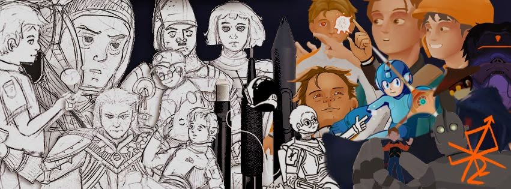
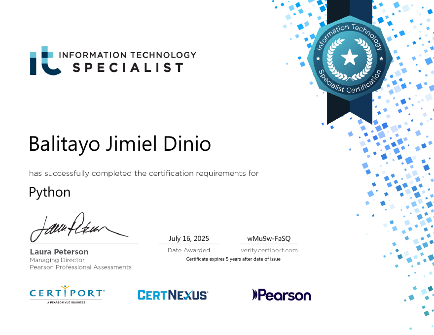
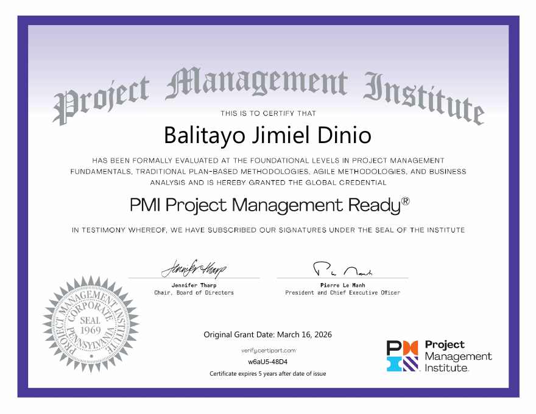

  

<h1 align="center">Hi, I'm Jim!</h1>

  
  
  

  

  

**Computer Science student** at FEU Institute of Technology specializing in Software Engineering, based in Quezon City, Philippines.

> I specialize in full-stack web deployment, computer vision workflows, and interactive digital simulations. Skilled in integrating LLM pipelines with intuitive, HCI-centered design.

## Who am I and what I believe in!

I like building things you can see and play with: interactive simulations, full-stack web apps, computer vision tools, and even a programming language of my own. When I'm not coding, I'm drawing, writing my comic series, or probably just lazing around :>

---

> The human eye proves reality as an imitation of something bigger than us. We see things and may not like it, but such, it shows us the truth of something that must be seen. The eye is the great witness and the heart is the great inspector.

---

## My Tech Stacks!

#### Languages

#### Frameworks & Libraries

#### Tools & Platforms

---

## Misc.

#### Design

---

## My GitHub Stats!

  
  

  

---

## My Favorite Projects!

**🍌 [S-Aging](https://github.com/yoellil/S-aging)**: Banana Disease Simulation (Thesis Project)

Models how disease spreads across a leaf surface (2D) and through the fruit (3D) over time.

> I led the UI/UX, built the interactive components and data visualizations, wrote the simulation logic, and deployed the web client on Vercel.

<!-- Add a screenshot or GIF here, it makes a big difference:  -->

**🪐 [MapaMars](https://github.com/S-Urchin/MapaMars)**: NASA Space Apps Challenge 2026 Entry

Built for planning and guiding manned missions on Mars, visualized in 3D and 2D.

> I contributed to the UI/UX development, built mission servicing page functions with different mission visualizations within the app, and deployed the web client on Vercel.

<!-- Add a screenshot or GIF here, it makes a big difference:  -->

---

## My Certifications!

  
  &nbsp;
  

  <b>IT Specialist in Python</b>, Certiport (Pearson VUE), 2025 &nbsp;•&nbsp;
  <b>PMI Project Management Ready®</b>, Project Management Institute, 2026

---

## Shameless Art Plug :>

I draw digitally for fun. See my art on [Cara](https://cara.app/spacechild) and [Instagram](https://instagram.com/kgryst.rs) :>

---

